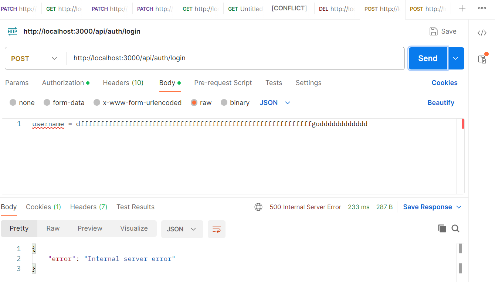

# Bug Report Template

เมื่อพบ bug โปรดกรอกฟอร์มนี้อย่างละเอียด

---

## ข้อมูลพื้นฐาน

**ชื่อ/ID นิสิต:66160018

**วันที่พบ bug:5/4/2569

**ลำดับที่ของ bug:1

---

## ข้อมูลเกี่ยวกับ Bug

### 1.เกิด Error 500 เมื่อส่ง Request Body เป็น JSON ผิดไวยากรณ์ (Login API)

**API and Integration Testing Focus - ทดสอบ Backend API อย่างถูกต้อง:**

### 2. ความสำคัญ (Severity)

เลือกระดับความสำคัญ:

- [ ] **Critical** - ระบบไม่ทำงาน/สูญเสียข้อมูล
- [X] **Major** - ฟังก์ชันหลักทำงานผิด
- [ ] **Minor** - ฟังก์ชันรองทำงานผิด
- [ ] **Trivial** - ปัญหาด้านการแสดงผล/UI

---

### 3. ลักษณะของ Bug (Type)

เลือกประเภท:

- [X] Functional bug (ฟังก์ชันทำงานผิด)
- [ ] Logic bug (ตรรกะผิด)
- [ ] Performance bug (ประสิทธิภาพต่ำ)
- [ ] Security bug (ความปลอดภัย)
- [ ] UI/UX bug (ปัญหาการแสดงผล)
- [ ] Database bug (ปัญหาฐานข้อมูล)
- [X] Other: Improper Error Handling (จัดการ Error ไม่เหมาะสม)

### 4. ส่วนที่มี Bug (Component/Module)

เลือกส่วนที่มี bug:

- [X] Authentication (การล็อกอิน)
- [ ] Books Management (จัดการหนังสือ)
- [ ] Members Management (จัดการสมาชิก)
- [ ] Borrowing/Return (ยืม/คืนหนังสือ)
- [ ] Dashboard (แดชบอร์ด)
- [ ] Database
- [X] API
- [ ] Other: **\*\*\*\***\_\_\_**\*\*\*\***

---

### 5. ขั้นตอนการสร้างซ้ำ (Steps to Reproduce)

ลิสต์ขั้นตอนทีละขั้นตอนเพื่อสร้างซ้ำ bug:

1. เปิดโปรแกรม Postman

2. ตั้งค่า HTTP Method เป็น POST และระบุ URL เป็น http://localhost:3000/api/auth/login

3. ไปที่แท็บ Body เลือกประเภทเป็น raw และเลือกรูปแบบเป็น JSON

4. ป้อนข้อมูลที่ผิดไวยากรณ์ JSON (Malformed JSON) เช่น ไม่ใส่เครื่องหมายปีกกา {} หรือพิมพ์รูปแบบผิด เช่น username = dffff

5. กดปุ่ม Send เพื่อส่ง Request

---

### 6. พฤติกรรมที่คาดหวัง (Expected Behavior)

ระบบควรทำงานอย่างไร:ระบบควรตรวจสอบความถูกต้องของรูปแบบข้อมูล (Payload) หากพบว่าไม่ใช่ JSON 
ที่ถูกต้อง ควรตอบกลับด้วย HTTP Status 400 Bad Request พร้อมข้อความแจ้งเตือน
ว่ารูปแบบข้อมูลไม่ถูกต้อง

### 7. พฤติกรรมจริง (Actual Behavior)

ระบบทำงานอย่างไรจริงๆ:

ระบบไม่สามารถอ่านข้อมูลได้ เกิด Unhandled Exception จนเซิร์ฟเวอร์ทำงานผิดพลาด
และตอบกลับด้วย HTTP Status 500 Internal Server Error

### 8. ผลกระทบ (Impact)

ผลกระทบต่อการใช้งาน:
ผู้ใช้งานหรือระบบ Frontend จะไม่ทราบสาเหตุที่แท้จริงของการเกิด Error 
และหากถูกยิง Request ผิดรูปแบบซ้ำๆ อาจทำให้เซิร์ฟเวอร์ล่ม (Crash) ได้

### 9. ข้อมูลเพิ่มเติม (Additional Information)

### ข้อมูล Environment:

- **OS:** Windows
- **Browser:** API Testing via Postman
- **Version of System:v2




### Error Messages:
{
    "error": "Invalid username or password"
}

### Console Logs:

(ถ้ามี logs ให้ใส่ที่นี่)

```
_________________________________________________________________

_________________________________________________________________
```

---

### 10. Related Bug Reports:

(ถ้าเกี่ยวข้องกับ bug อื่น ให้ระบุ)

```
Bug #: ___________
Bug #: ___________
```

---

## Checklist ก่อนส่ง

- [ ] ได้ทดสอบสร้างซ้ำปัญหาแล้ว
- [ ] ไม่ใช่ duplicate bug
- [ ] ได้เล็งทีหัวข้อให้ชัดเจน
- [ ] ได้ให้ขั้นตอนการสร้างซ้ำแบบขั้นต่ำ (Minimal reproduction)
- [ ] ได้เพิ่มรูปหรือข้อมูลเพิ่มเติม (ถ้ามี)
- [ ] ได้ตรวจสอบความถูกต้องของข้อมูลแล้ว

---

## เคล็ดลับการรายงาน Bug ที่ดี

✅ **ดี:**

- "เมื่อยืมหนังสือวันที่ 1 พค. และกำหนดคืนวันที่ 15 พค. หลังคืนวันที่ 20 พค. ระบบคำนวณค่าปรับเป็น 0 บาท แต่ควรเป็น 50 บาท"

❌ **ไม่ดี:**

- "ระบบคำนวณค่าปรับผิด"

✅ **ดี:**

- ให้ขั้นตอนเต็ม 1, 2, 3, ...

❌ **ไม่ดี:**

- "เพิ่มสมาชิกแล้วระบบมีปัญหา"

---
